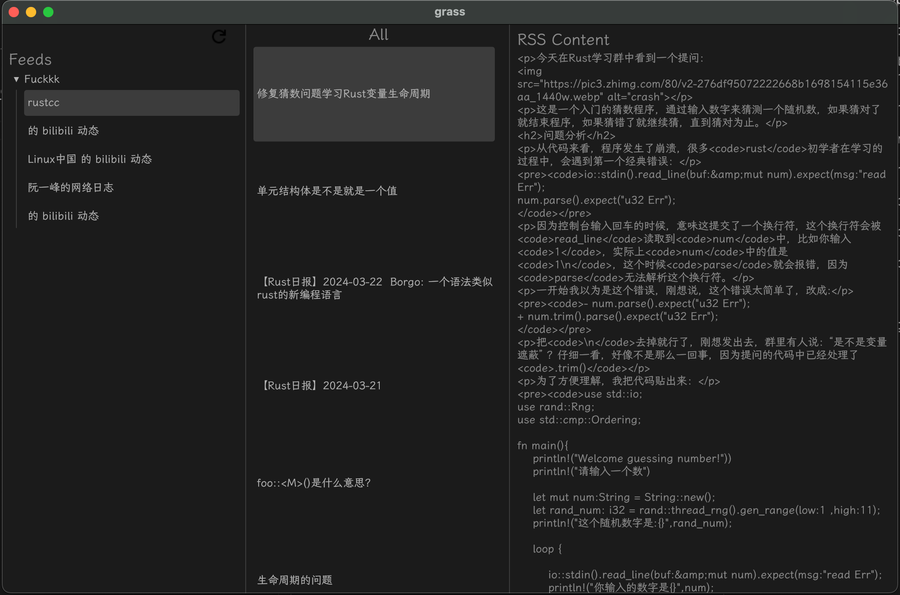

# grass

An attmpt to implement a RSS reader app using Rust.

The project is unfinished due to a [lack of web view support](https://github.com/emilk/egui/discussions/1353) in [egui](https://github.com/emilk/egui/tree/master) framework.

Lesson learned...
